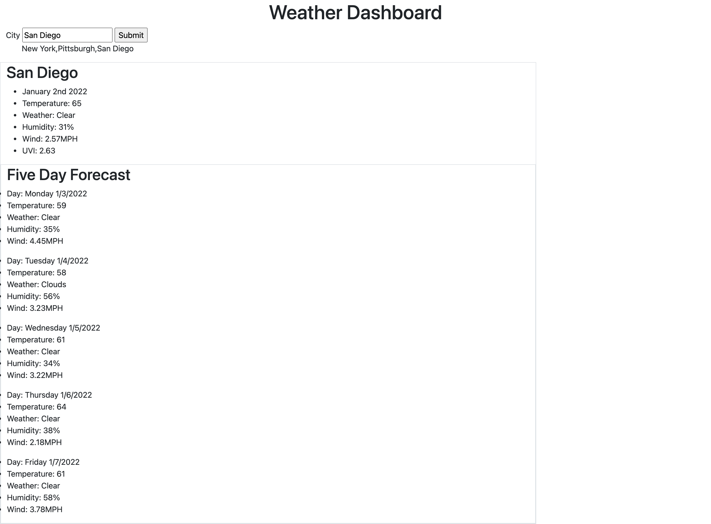

# Weather-Dashboard
  
  
  ## Description 
  The goal of this assignment is to use the one weather api to retrieve the weather information for any city that a user looks up. All cities searched will appear and will be saved to local storage.

  ## Table of Contents
  * [License](#license)
  * [Questions](#questions)
  * [Media](#media)

  ## License 
  This project is license under MIT License
 

  ## Questions
  If you have any questions about this projects, please contact me directly at nathaniel.epstein@gmail.com. You can view more of my projects at https://github.com/natpitt2393.

  ## Media
  
  